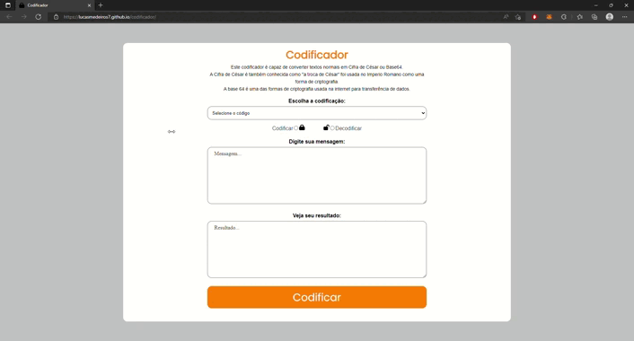

<h1 align="center">
  Codificador
</h1>

<h2>Codficador/Decodificador de "Cifra de César" e "Base64".</h2> 
 

  

## 🚀 Tecnologias

Esse projeto foi desenvolvido com as seguintes tecnologias:

- HTML
- CSS
- Javascript

## 🚧 Projeto

Live Preview: https://lucasmedeiros7.github.io/codificador/

Feito com ♥ by Lucas Medeiros
